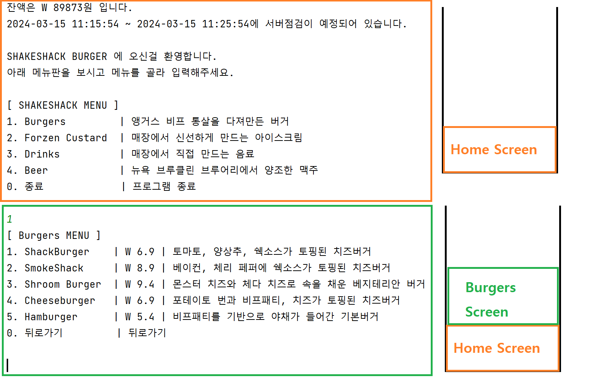
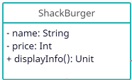
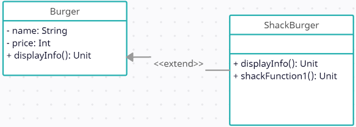

# 프로그래밍 심화 과제 - 키오스크

- MVP 아키텍처를 적용했습니다.
- 커멘드 창에 출력되는 화면 단위에 따라 Screen을 구성하였습니다.
</br>더 이상 화면에서 처리할 내역이 없으면 Stack에서 pop을 호출하여 이전 화면이 보이도록 했습니다.
- Stack이 비게 되면 프로그램이 종료됩니다.




### 📙 [요구 사항 분석](docs/README.md)


### 📕 필수 구현 사항

<details>
    <summary><strong>Lv0</strong></summary>

- 과제 시작 전 어떻게 구현할 것인지에 그려 보는 과정입니다.
- 요구 사항별로 상세 기능을 생각합니다.
- 사용하면서 발생할 수 있는 예외 사항들을 고려합니다.

```jsx
[ 필요한 기능 ]
요구사항1: 메인 메뉴판 화면
: 메뉴 선택시 상세 메뉴화면으로 이동
: 잘못된 번호 선택 시 예외처리
: 프로그램 종료을 위한 번호 정의

요구사항2: ~~~
요구사항3: ~~~
요구사항4: ~~~
```

</details>

<details>
    <summary><strong>Lv1</strong></summary>
<aside>
    📢 <strong>Lv1 구현을 위해서는 `조건`과 `반복`의 개념을 알고 있어야 합니다!</strong>

</aside>

- 프로그램을 실행하면 메뉴판의 번호들을 보여줍니다.(대분류의 메뉴를 보여줌)
- 대분류 메뉴에 해당하는 숫자를 입력하면 선택하면 세부 메뉴들을 보여줍니다.
    - 예를 들어 햄버거에 해당하는 숫자를 입력 하면
      햄버거 1, 햄버거 2 처럼 세부 종류를 보여줘요.(출력 예시 참고)
- `반복문`을 이용해서 메뉴 선택할 수 있게 유지하고
  대분류 메뉴에서, 0번이 입력되면 프로그램을 종료합니다.

---

- **출력 예시**

    ```elm
    아래 메뉴판을 보시고 메뉴를 골라 입력해주세요.
    
    [ SHAKESHACK MENU ]
    1. Burgers         | 앵거스 비프 통살을 다져만든 버거
    2. Forzen Custard  | 매장에서 신선하게 만드는 아이스크림
    3. Drinks          | 매장에서 직접 만드는 음료
    4. Beer            | 뉴욕 브루클린 브루어리에서 양조한 맥주
    0. 종료            | 프로그램 종료
    
    "1"
    
    [ Burgers MENU ]
    1. ShackBurger   | W 6.9 | 토마토, 양상추, 쉑소스가 토핑된 치즈버거
    2. SmokeShack    | W 8.9 | 베이컨, 체리 페퍼에 쉑소스가 토핑된 치즈버거
    3. Shroom Burger | W 9.4 | 몬스터 치즈와 체다 치즈로 속을 채운 베지테리안 버거
    3. Cheeseburger  | W 6.9 | 포테이토 번과 비프패티, 치즈가 토핑된 치즈버거
    4. Hamburger     | W 5.4 | 비프패티를 기반으로 야채가 들어간 기본버거
    0. 뒤로가기      | 뒤로가기
    0 <-
    
    "0"
    "2"
    
    [ Forzen Custard MENU ]
    1. ...
    2. ...
    3. ...
    4. ...
    0. 뒤로가기      | 뒤로가기
    
    "0"
    "0"
    
    프로그램을 종료합니다.
    ```

</details>


<details>
    <summary><strong>Lv2</strong></summary>

<aside>
    📢 <strong>Lv2 구현을 위해서는 `메소드`와 `클래스`의 개념을 알고 있어야 합니다!</strong>
</aside>

- 필요한 클래스들을 설계합니다.(버거, 아이스크림, 음료, 맥주, 주문, 공통 등)
- 클래스들의 `프로퍼티`와 `메소드`를 정의합니다
    - 예를 들어 아래 이미지처럼 클래스 다이어그램을 그려봅시다.
    - 햄버거는 이름, 가격 같은 프로퍼티와 정보를 출력하는 메소드가 있을 수 있죠?
- `Lv1`에서 작성한 로직을 메소드로 만듭니다.
---



</details>


<details>
    <summary><strong>Lv3</strong></summary>
<aside>
    📢 <strong>Lv3 구현을 위해서는 `상속`과 `컬렉션`의개념을 알고 있어야 합니다!</strong>>
</aside>

- `Lv2`에서 설계한 클래스들을 `상속 관계`를 가지도록 변경합니다.
- Burger도 부모 클래스를 가질 수 있을지 고민해봅시다.
  - 예를 들어 ShackBurger는 Burger의 자식이고, Burger는 Food의 자식일수도 있습니다.
  - **해당 부분은 반드시 이해가 필요합니다!
    검색&튜터님들의 도움을 받아 꼭 짚고 넘어갑시다!**
- 하나의 리스트 객체로 모든 메뉴들을 관리하도록 수정합니다. **`List`**
- 프로그램을 실행하면 메인에서 init 메소드를 실행하여 메뉴들을 객체화하고 리스트에 담아둡니다.
- **예시**
```kotlin
리스트변수1

fun main() {
    init()
}

fun init() {
    햄버거 객체 생성해서 리스트 변수1에 add하는 로직
}
```
---


```kotlin
fun main() {
    var 리스트변수 = ArrayList<클래스타입>()
}
```

</details>

### 📗 선택 구현 사항

<details>
    <summary><strong>Lv4</strong></summary>

<aside>
    📢 <strong>Lv4 구현을 위해서는 `예외처리`의 개념을 알고 있어야 합니다!</strong>
</aside>

- 메뉴판 번호는 숫자기에 숫자를 입력해야 하는데 문자를 입력했을 때,
  메뉴판에 없는 숫자를 입력했을 때,
  다시 입력할 수 있도록 `예외처리` 합니다.
- 현재 잔액과 가격을 비교해서 구매 가능한 상태를 클래스에 추가적으로 구현합니다.
    - 예를 들어 구매할만큼 충분한 돈이 있는지도 상태에 포함시킵니다.

---

- **출력 예시**

```jsx
"SHAKESHACK BURGER 에 오신걸 환영합니다."
아래 메뉴판을 보시고 메뉴를 골라 입력해주세요.

[ SHAKESHACK MENU ]
1. Burgers         | 앵거스 비프 통살을 다져만든 버거
2. Forzen Custard  | 매장에서 신선하게 만드는 아이스크림
3. Drinks          | 매장에서 직접 만드는 음료
4. Beer            | 뉴욕 브루클린 브루어리에서 양조한 맥주

"5"
잘못된 번호를 입력했어요 다시 입력해주세요.
"6"
잘못된 번호를 입력했어요 다시 입력해주세요.
"1"

[ Burgers MENU ]
1. ShackBurger   | W 6.9 | 토마토, 양상추, 쉑소스가 토핑된 치즈버거
2. SmokeShack    | W 8.9 | 베이컨, 체리 페퍼에 쉑소스가 토핑된 치즈버거
3. Shroom Burger | W 9.4 | 몬스터 치즈와 체다 치즈로 속을 채운 베지테리안 버거
3. Cheeseburger  | W 6.9 | 포테이토 번과 비프패티, 치즈가 토핑된 치즈버거
4. Hamburger     | W 5.4 | 비프패티를 기반으로 야채가 들어간 기본버거
0. 뒤로가기      | 뒤로가기

"4"

"Hamburger     | W 5.4 | 비프패티를 기반으로 야채가 들어간 기본버거"
위 메뉴를 장바구니에 추가하시겠습니까?
1. 확인        2. 취소

"1"

Hamburger 가 장바구니에 추가되었습니다.

"SHAKESHACK BURGER 에 오신걸 환영합니다."
아래 메뉴판을 보시고 메뉴를 골라 입력해주세요.

[ SHAKESHACK MENU ]
1. Burgers         | 앵거스 비프 통살을 다져만든 버거
2. Forzen Custard  | 매장에서 신선하게 만드는 아이스크림
3. Drinks          | 매장에서 직접 만드는 음료
4. Beer            | 뉴욕 브루클린 브루어리에서 양조한 맥주

[ ORDER MENU ]
5. Order       | 장바구니를 확인 후 주문합니다.
6. Cancel      | 진행중인 주문을 취소합니다.

"5"

아래와 같이 주문 하시겠습니까?

[ Orders ]
Hamburger     | W 5.4 | 비프패티를 기반으로 야채가 들어간 기본버거

[ Total ]
W 6.9

1. 주문      2. 메뉴판

"1"

현재 잔액은 5.5W 으로 1.4W이 부족해서 주문할 수 없습니다.
```

</details>

<details>
    <summary><strong>Lv5</strong></summary>

<aside>
    📢 <strong>Lv5 구현을 위해서는 `쓰레드`의개념을 알고 있어야 합니다!</strong>>
</aside>

- 특정 작업이 종료된 후, `3초 뒤`에 다른 작업을 수행할 수 있도록 코드를 작성합니다.
- 결제할 때 현재 시간을 비교하여 `특정 시간대`에는 결제할 수 없다는
  알림 메시지를 콘솔창에 출력해줍니다.
- 결제가 완료 되었다면 시간을 띄워줍니다.(출력 예시 참고)
- 프로그램을 종료할 때까지 `5초마다` 현재 주문 대기수를 실시간으로 출력해줍니다.

---

- **출력 예시**

```jsx
아래와 같이 주문 하시겠습니까? (현재 주문 대기수: 2)

[ Orders ]
ShackBurger   | W 6.9 | 토마토, 양상추, 쉑소스가 토핑된 치즈버거

[ Total ]
W 6.9

1. 주문      2. 메뉴판

"1"

현재 시각은 오후11시 10분입니다. 
은행 점검 시간은 오후11시 10분 ~ 오후 11시 20분이므로 결제할 수 없습니다.

아래와 같이 주문 하시겠습니까? (현재 주문 대기수: 3)

[ Orders ]
ShackBurger   | W 6.9 | 토마토, 양상추, 쉑소스가 토핑된 치즈버거

[ Total ]
W 6.9

1. 주문      2. 메뉴판

"1"

결제를 완료했습니다. (2023-01-01 23:25:12)
```

</details>

<details>
    <summary><strong>Lv??</strong></summary>

<aside>
    📢 <strong>Lv?? 구현을 위해서는 `???`의개념을 알고 있어야 합니다!</strong>

</aside>

- 모든 사항을 구현 완료 했다면 여기서 어떻게 더 확장&고도화 할 수 있을지 고민해봅시다!
  - `할인` `세트 메뉴` `수량 제한 메뉴` 등

</details>

